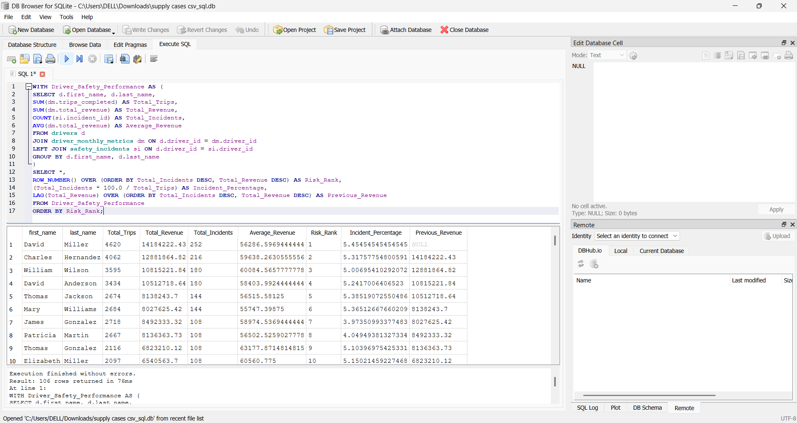

# Project 3: Driver Safety Risk and Revenue Analysis

## Supply Chain Safety & Performance Analysis

### Business Impact
Understanding the relationship between driver performance and safety incidents helps logistics companies identify high-risk drivers, improve training programmes, and optimise fleet operations. This analysis supports better resource allocation, reduces accident-related costs, and enhances overall supply chain efficiency.

### Project Goal
Identify drivers with the highest incident counts along with highest revenue, and determine whether risk scales with trip volume or driver behaviour.

### Dataset
- **Source**: Kaggle (Driver Performance Logistics Dataset)
- **Tables Used**:
  - `drivers`
  - `driver_monthly_metrics`
  - `safety_incidents`

### Tools Used
- SQLite
- DB Browser for SQLite

### Key Skills Demonstrated
- Multi-table `JOIN`s (3 tables)
- Aggregation (`SUM`, `COUNT`, `AVG`)
- CTE (`WITH`)
- Window Functions (`ROW_NUMBER`, `LAG`)
- Incident Percentage Calculation

### SQL Query
```sql
WITH Driver_Safety_Performance AS (
    SELECT 
        d.first_name,
        d.last_name,
        SUM(dm.trips_completed) AS Total_Trips,
        SUM(dm.total_revenue) AS Total_Revenue,
        COUNT(si.incident_id) AS Total_Incidents,
        AVG(dm.total_revenue) AS Average_Revenue
    FROM drivers d
    JOIN driver_monthly_metrics dm ON d.driver_id = dm.driver_id
    LEFT JOIN safety_incidents si ON d.driver_id = si.driver_id
    GROUP BY d.first_name, d.last_name
)
SELECT *,
    ROW_NUMBER() OVER (ORDER BY Total_Incidents DESC, Total_Revenue DESC) AS Risk_Rank,
    (Total_Incidents * 100.0 / Total_Trips) AS Incident_Percentage,
    LAG(Total_Revenue) OVER (ORDER BY Total_Incidents DESC, Total_Revenue DESC) AS Previous_Revenue
FROM Driver_Safety_Performance
ORDER BY Risk_Rank;
```

**Outcome:** Successfully analysed driver performance across multiple related tables to identify high-revenue drivers with significant trip volumes and safety incidents. The analysis highlights how higher operational activity and revenue can also be associated with increased exposure to safety incidents.

## Key Findings (Top Results)

| Rank | Driver Name | Total Trips | Total Revenue | Total Incidents | Incident Percentage |
|------|-------------|-------------|---------------|-----------------|---------------------|
| 1 | David Miller | 4,620 | 14,184,222.43 | 252 | 5.45% |
| 2 | Charles Hernandez | 4,062 | 12,881,864.82 | 216 | 5.32% |
| 3 | William Wilson | 3,595 | 10,815,221.84 | 180 | 5.00% |

**Key Insight:** Safety risk remains the primary focus of the analysis, while revenue and trip volume provide additional context for understanding driver performance. The results show that some of the highest-earning drivers also have high trip volumes and elevated incident rates.

*Note: Full output results are provided below and in `Project 3 - Driver Safety Analysis/Project3.png`.*


